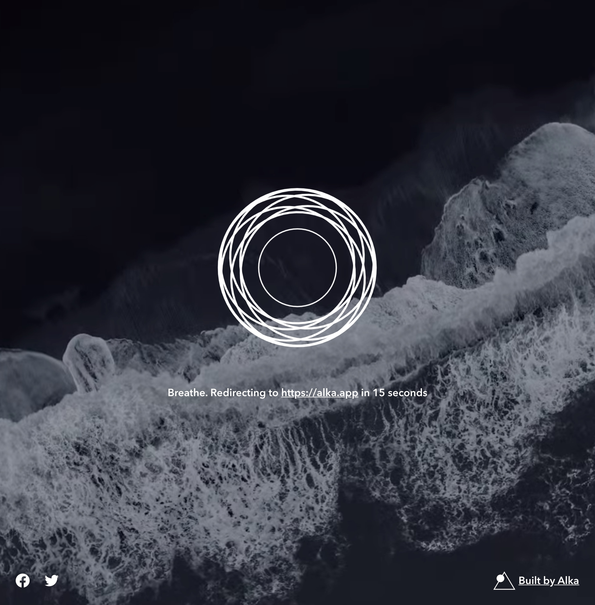

# Breathe

[](https://david-dm.org/alkafinance/breathe.sh)
[](https://david-dm.org/alkafinance/breathe.sh?type=dev)

> Take a breath before jumping into the most stressful parts of the internet

Built with [Next.js](https://nextjs.org/).



## Development

1. **Install node/npm/yarn.** The app has been tested with node v12.

2. **Clone and install dependencies**:
```shell
$ git clone https://github.com/alkafinance/breathe.sh.git breathe-sh
$ cd breathe-sh
$ yarn
```

3. **Run the app**:
```shell
$ yarn dev
```

## License

[GNU Affero General Public License v3.0](./LICENSE) © Alka, Inc
